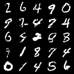

# A PyTorch Implementation of Generative Adversarial Nets

파이토치로 구현된 Generative Adversarial Nets (Goodfellow et al, 2014) 코드입니다.
모델의 구조와 학습 스케줄은 [공식 깃허브 저장소](https://github.com/goodfeli/adversarial) 를 기준으로 만들어졌습니다.
현재 `torchvision.datasets.MNIST` 데이터셋에 대한 학습을 지원합니다.



## Training


```bash
# MNIST: 하이퍼파라미터들의 기본값은 MNIST 데이터를 기준으로 세팅되어있습니다
python main.py --mode train --dataset MNIST
```

## Test

```bash
# MNIST
python main.py --mode test --dataset MNIST --test_checkpoint 300
```

## Arguments

param|type|default|help
---|---|---|---
mode|str|"train"
epochs|int|300|Total number of epochs
resume_epoch|int|0|Resume training from this point
checkpoint_every|int|50|Save checkpoint every n epochs
latent_dim|int|100|Dimensions of latent space
uniform_range|float|3 ** 0.5|Range of latent vector elements: Uniform(-x, x)
img_size|int|28|Size of input images
num_channels|int|1|Number of channels in input image
lr|float|1e-1|Initial value for the learning rate
min_lr|float|1e-6|The learning rate will be clipped to be at least this value
decay_factor|float|1 / (1+4e-6)|Multiplicative factor of learning rate decay
momentum|float|0.5|Initial value for the momentum coefficient
final_momentum|float|.7|The momentum coefficient to use at the end of learning
momentum_saturate|int|250|The epoch on which the moment should reach its final value
batch_size|int|100|Size of minibatch
root|str|"./data"|Root directory where datasets will be stored
dataset|str|"MNIST"|Dataset to be used for training
num_workers|int|4|Number of data loader processes
num_samples|int|25|Number of fake images to generate
test_checkpoint|int|300|Checkpoint number to use for testing
checkpoint_dir|str|"checkpoints"|Path to save model checkpoints
sample_dir|str|"samples"|Path to save generated images
test_dir|str|"test"|Path to save test results
seed|int|777|Random seed

## References

- Goodfellow, Ian, et al. "Generative adversarial nets." Advances in neural information processing systems 27 (2014).