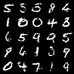
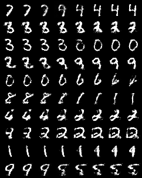

# A PyTorch Implementation of Generative Adversarial Nets

This is a PyTorch implementation of Generative Adversarial Nets(Goodfellow et al, 2014).
The model's structure and training schedule are based on the author's [original implementation](https://github.com/goodfeli/adversarial).
This code currently supports training on `torchvision.datasets.MNIST`.
The structure of the code mimics [stargan-v2](https://github.com/clovaai/stargan-v2) repository.

Fake images at epoch 250 |  Latent vector interpolation
:-------------------------:|:-------------------------:
  |

## Training

If you run the code in training mode as shown below, you will make 250 epochs, and the checkpoints will be saved in the `checkpoints` directory every 50 epochs.
`samples` directory stores sample images that are generated for each epoch.
If you want to resume training from a saved checkpoint, you can set the epoch number in `--resume_epoch` argument.
To resume training, the checkpoint file for the appropriate epoch must exist.

```bash
python main.py \
  --mode train \
  --dataset MNIST \
  --epochs 250 \
  --checkpoint_dir checkpoints \
  --sample_dir samples \
  --checkpoint_every 50 \
  --resume_epoch 50 # optional
```

## Test

When you run code in test mode, the model corresponding to `test_checkpoint` is restored to create sample images.
The generated images will be stored in the directory specified in `--test_dir` argument.
When running in test mode, specify `--mode`, `--dataset`, and `--test_checkpoint`.

```bash
# MNIST
python main.py --mode test --dataset MNIST --test_checkpoint 250
```

## Model Architecture

The structure of the models applied to the MNIST dataset is as follows.
The generator used ReLU stacks, the discriminator used dropout and maxout stacks.
I have imitated the author's implementation as much as possible, but there may be some differences.
The structure of the models can be modified in the `core.model` module.

```
>>> from core.model import Generator, Discriminator
>>> g = Generator(28, 1, 100) 
>>> print(g)
Generator(
  (layers): Sequential(
    (0): Linear(in_features=100, out_features=1200, bias=True)
    (1): ReLU()
    (2): Linear(in_features=1200, out_features=1200, bias=True)
    (3): ReLU()
    (4): Linear(in_features=1200, out_features=784, bias=True)
    (5): Sigmoid()
  )
)
>>> d = Discriminator(28, 1) 
>>> print(d)
Discriminator(
  (layers): Sequential(
    (0): Flatten(start_dim=1, end_dim=-1)
    (1): Dropout(p=0.2, inplace=False)
    (2): LinearMaxOut(
      (linear): Linear(in_features=784, out_features=1200, bias=True)
    )
    (3): Dropout(p=0.5, inplace=False)
    (4): LinearMaxOut(
      (linear): Linear(in_features=240, out_features=1200, bias=True)
    )
    (5): ReLU()
    (6): Dropout(p=0.5, inplace=False)
    (7): Linear(in_features=240, out_features=1, bias=True)
    (8): Sigmoid()
  )
)
```

## Solver

The `core.solver.Solver` class manages the actual learning loop.
I used the SGD optimizer as implemented by the author to adjust the learning rate and momentum as the training progresses.
Learning rates decrease exponentially every batch, and momentum increases linearly every epoch.

## Arguments

The default hyperparameters are set based on MNIST data.

Argument|Type|Default|Help
---|---|---|---
mode|str|"train"
epochs|int|300|Total number of epochs
resume_epoch|int|0|Resume training from this point
checkpoint_every|int|50|Save checkpoint every n epochs
latent_dim|int|100|Dimensions of latent space
uniform_range|float|3 ** 0.5|Range of latent vector elements: Uniform(-x, x)
img_size|int|28|Size of input images
num_channels|int|1|Number of channels in input image
lr|float|1e-1|Initial value for the learning rate
min_lr|float|1e-6|The learning rate will be clipped to be at least this value
decay_factor|float|1 / (1+4e-6)|Multiplicative factor of learning rate decay
momentum|float|0.5|Initial value for the momentum coefficient
final_momentum|float|.7|The momentum coefficient to use at the end of learning
momentum_saturate|int|250|The epoch on which the moment should reach its final value
batch_size|int|100|Size of minibatch
root|str|"./data"|Root directory where datasets will be stored
dataset|str|"MNIST"|Dataset to be used for training
num_workers|int|4|Number of data loader processes
num_samples|int|25|Number of fake images to generate
test_checkpoint|int|300|Checkpoint number to use for testing
checkpoint_dir|str|"checkpoints"|Path to save model checkpoints
sample_dir|str|"samples"|Path to save generated images
test_dir|str|"test"|Path to save test results
seed|int|777|Random seed

## References

- Goodfellow, Ian, et al. "Generative adversarial nets." Advances in neural information processing systems 27 (2014).